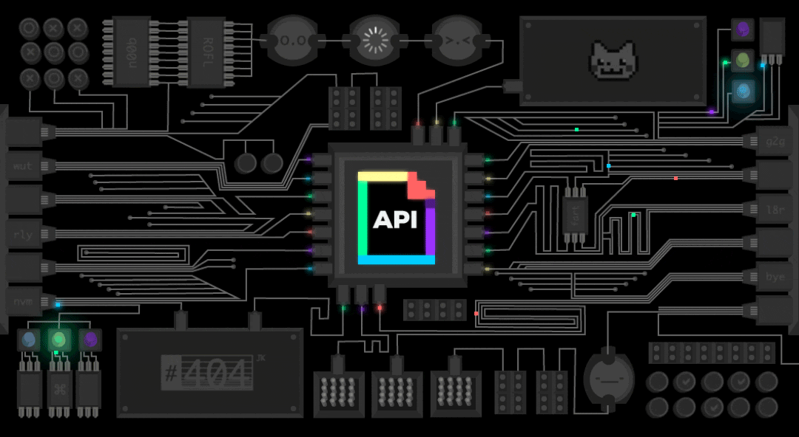

# GIPHY API Documentation

**6/20/17 Update:** The documentation that used to live here has moved! Check out the [new home for our docs](http://developers.giphy.com/docs) on our standalone developer portal, [GIPHY Developers](http://developers.giphy.com)!

[GIPHY](http://www.giphy.com) is an animated [GIF](http://en.wikipedia.org/wiki/Graphics_Interchange_Format) search engine. The GIPHY API is a series of JSON read endpoints that allow you to integrate the features of GIPHY's search engine into your project or app. 

To view detailed documentation and code samples and to be assigned API Keys for your apps, visit [GIPHY Developers](http://developers.giphy.com), our developer portal.

# Reporting Issues

To report issues with the API or its documentation, please use the [GitHub Issues](https://github.com/Giphy/GiphyAPI/issues) tab for this repo. We appreciate your feedback!

# Learn more about [Engineering at Giphy](https://engineering.giphy.com) 
